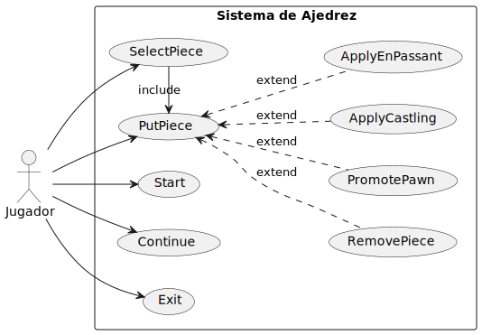

# Ajedrez en C++

## Diagrama de Casos de Uso



Este proyecto es un juego de ajedrez funcional desarrollado en C++, creado como una demostración práctica de los principios fundamentales de diseño de la ingeniería de software. El objetivo principal no es solo construir un juego de ajedrez, sino hacerlo aplicando meticulosamente las mejores prácticas para crear una base de código que sea mantenible, escalable y fácil de entender.

## Objetivo Principal: Demostración de Principios de Diseño

El propósito principal de este repositorio es servir como un caso de estudio en la aplicación de principios clave de la ingeniería de software. Busca mostrar cómo estos conceptos pueden integrarse en un proyecto real de C++ para mejorar su calidad y estructura.

## Principios de Diseño Aplicados

Los siguientes principios fueron fundamentales para el desarrollo de este proyecto:

### SOLID
Los principios SOLID son un conjunto de cinco principios de diseño destinados a hacer que los diseños de software sean más comprensibles, flexibles y mantenibles.

*   **Principio de Responsabilidad Única (SRP):** Cada clase tiene una, y solo una, razón para cambiar. Por ejemplo, la clase `Board` solo es responsable de gestionar el estado del tablero de ajedrez, mientras que los derivados de `Piece` manejan la lógica específica de cada pieza.
*   **Principio de Abierto/Cerrado (OCP):** Las entidades de software (clases, módulos, funciones) deben estar abiertas a la extensión pero cerradas a la modificación. Esto se utiliza ampliamente en las reglas de movimiento de las piezas, donde se pueden agregar nuevas piezas o movimientos especiales sin modificar la lógica de verificación de reglas existente.
*   **Principio de Sustitución de Liskov (LSP):** Los objetos de una superclase deben ser reemplazables por objetos de una subclase sin afectar la corrección del programa. Todos los tipos de piezas (por ejemplo, `Rook`, `Pawn`) son sustituibles por la clase base `Piece`.
*   **Principio de Segregación de Interfaces (ISP):** Ningún cliente debe ser forzado a depender de métodos que no utiliza. Se definen diferentes interfaces de controlador (`OperationController`, `PlacementController`) para que las vistas solo interactúen con las operaciones que necesitan.
*   **Principio de Inversión de Dependencias (DIP):** Los módulos de alto nivel no deben depender de los módulos de bajo nivel. Ambos deben depender de abstracciones. La lógica depende de abstracciones como `OperationController` en lugar de implementaciones concretas como `LocalOperationController`.
*   **Principio de Responsabilidad Única (SRP):** Cada clase tiene una, y solo una, razón para cambiar. Por ejemplo, la clase `Board` solo es responsable de gestionar el estado del tablero de ajedrez, mientras que los derivados de `Piece` manejan la lógica específica de cada pieza.
*   **Principio de Abierto/Cerrado (OCP):** Las entidades de software (clases, módulos, funciones) deben estar abiertas a la extensión pero cerradas a la modificación. Esto se utiliza ampliamente en las reglas de movimiento de las piezas, donde se pueden agregar nuevas piezas o movimientos especiales sin modificar la lógica de verificación de reglas existente.
*   **Principio de Sustitución de Liskov (LSP):** Los objetos de una superclase deben ser reemplazables por objetos de una subclase sin afectar la corrección del programa. Todos los tipos de piezas (por ejemplo, `Rook`, `Pawn`) son sustituibles por la clase base `Piece`.
*   **Principio de Segregación de Interfaces (ISP):** Ningún cliente debe ser forzado a depender de métodos que no utiliza. Se definen diferentes interfaces de controlador (`OperationController`, `PlacementController`) para que las vistas solo interactúen con las operaciones que necesitan.
*   **Principio de Inversión de Dependencias (DIP):** Los módulos de alto nivel no deben depender de los módulos de bajo nivel. Ambos deben depender de abstracciones. La lógica depende de abstracciones como `OperationController` en lugar de implementaciones concretas como `LocalOperationController`.

### DRY (No te repitas)
El principio DRY establece que "Cada pieza de conocimiento debe tener una representación única, inequívoca y autorizada dentro de un sistema". Evitamos la duplicación de código abstrayendo funcionalidades comunes en clases base y funciones de ayuda, como las estrategias de movimiento para las piezas (`HorizontalMovementStrategy`, `DiagonalMovementStrategy`).

### YAGNI (No vas a necesitarlo)
La funcionalidad solo se agregó cuando fue necesaria. El proyecto se centra en ofrecer la lógica central del ajedrez y una interfaz de consola simple, evitando la optimización prematura o características que no son esenciales para el objetivo principal.

### Código Limpio
Siguiendo los principios de Código Limpio, el código está escrito para ser legible y auto-documentado. Esto incluye:
*   **Nombres Significativos:** Las variables y funciones se nombran para expresar claramente su propósito.
*   **Funciones Pequeñas:** Las funciones se mantienen cortas y enfocadas en una sola tarea.
*   **Estructura Clara:** El proyecto está organizado en módulos y directorios lógicos.

### MVC (Modelo-Vista-Controlador)
El proyecto está estructurado siguiendo un patrón de arquitectura Modelo-Vista-Controlador para garantizar una clara separación de responsabilidades:
*   **Modelo:** Representa los datos centrales y la lógica de negocio del juego (ej., `Game`, `Board`, `Piece`). Es completamente independiente de la interfaz de usuario.
*   **Vista:** Responsable de presentar el modelo al usuario. La vista de `consola` (`ConsoleView`, `BoardView`) es una implementación concreta que muestra el estado del juego en la línea de comandos.
*   **Controlador:** Actúa como intermediario entre el Modelo y la Vista, manejando la entrada del usuario y actualizando el modelo según sea necesario (ej., `StartController`, `SelectPieceController`).

### Separación de Responsabilidades
Más allá de MVC, las responsabilidades están claramente distribuidas. Por ejemplo, la validación de coordenadas, la lógica de movimiento de piezas, las transiciones de estado del juego y la interacción del usuario son manejadas por partes distintas del sistema, lo que hace que la base de código sea más fácil de depurar, probar y extender.

## Estructura del Proyecto

El proyecto está organizado en una estructura de directorios que separa claramente las interfaces (`include`), las implementaciones (`src`), la compilación (`build`), los ejecutables (`bin`) y la documentación (`docs`). Esta organización facilita la navegación y el mantenimiento del código.

- **`/include`**: Contiene todos los archivos de cabecera (`.hpp`). Define las "interfaces" o contratos de todas las clases y módulos del sistema.
    - `common/`: Utilidades transversales como constantes (`BoardConstants.hpp`) y validadores.
    - `models/`: **(Modelo)** Contiene la lógica de negocio y las estructuras de datos del juego.
        - `pieces/`: Define las piezas del ajedrez, sus movimientos base, reglas especiales (`EnPassantPawnSpecialRuleGenerator.hpp`) y comportamientos. Es el corazón del modelo.
        - `Game.hpp`, `Board.hpp`, `Turn.hpp`: Clases centrales que gestionan el estado y las reglas del juego.
    - `views/`: **(Vista)** Responsable de la presentación de datos al usuario.
        - `console/`: Implementación concreta de la vista para la línea de comandos. `BoardView.hpp` se encarga de "dibujar" el tablero.
    - `controllers/`: **(Controlador)** Actúa como intermediario entre el Modelo y la Vista.
        - `local/`: Implementación de los controladores para una partida local. La subcarpeta `logic/` contiene la lógica de estados (`InitialState`, `InGameState`, etc.) que gestiona el ciclo de vida de la partida.
        - `OperationController.hpp`, `PlacementController.hpp`: Definen las operaciones que la vista puede invocar, siguiendo el Principio de Segregación de Interfaces.

- **`/src`**: Contiene los archivos de implementación (`.cpp`) que desarrollan la lógica definida en los encabezados de `/include`. La estructura de directorios en `src` es un espejo de la de `include`, lo que facilita la localización del código.

- **`/build`**: Almacena los archivos intermedios generados durante el proceso de compilación (archivos objeto `.o`, dependencias).

- **`/bin`**: Contiene el archivo ejecutable final (`chess`) generado tras una compilación exitosa.

- **`/docs`**: Incluye la documentación del proyecto.
    - `diagrams/`: Contiene los diagramas de diseño, tanto en su formato de código fuente (`.wsd` de PlantUML) como en su formato de imagen (`.svg`).

- **`Makefile`**: El script que automatiza el proceso de compilación y enlazado del proyecto. Define comandos como `make` para construir el ejecutable.

## Cómo Compilar y Ejecutar

1.  **Clona el repositorio.**
2.  **Navega al directorio raíz del proyecto.**
3.  **Compila el código:**
    ```sh
    make

4.  **Ejecuta el juego:**
    ```sh
    ./bin/chess
    ```